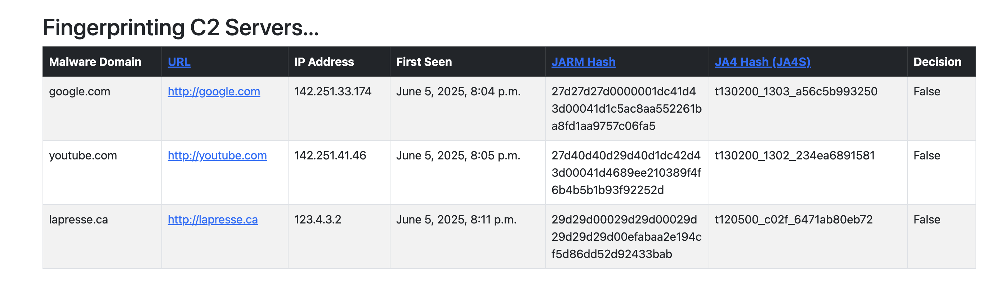

# (3.4) Validate Cyberthreat Infrastructure
> GeekWeek10 Guild 3 Team 4

As malicious actors change and relocate their infrastructure to avoid detection, we need to :
* A. constantly verify that our data and **indicators of compromise (IoCs)** are still valid
* B. regularly browse the Internet to validate existing information about malicious infrastructure
* C. Could we build something similar to Shodan or Censys  ?
* D. that could confirm command and control (C2) information for a specific malware family?

TOOL:


## 1. Setup a Django (Python Web framework) Project

> 1.0 Create the Project
```bash
# Create a Python Virtual Environment [ Avoids messing with the Python instance used by your OS ]
> python -m venv .venv
> source .venv/bin/activate
> pip install django requests

# start the 'c2_scanner' Django project
> django-admin startproject c2_scanner
> cd c2_scanner

```

> 1.1 Create the Database
```bash
# create a Django application 'scanner'
> python manage.py startapp scanner

# register the 'scanner' app in the 'c2_scanner' project
> vim c2_scanner/settings.py
>> INSTALLED_APPS = [ ..., 'scanner', ]

# define 'scanner' app Django models [ Database, Table Schemas ]
> vim c2_scanner/scanner/models.py

>> class SuspiciousIP(models.Model):
>>     malware_name = models.CharField(max_length=255)  # Example: SuperShell, HookBot, Chaos...
>>     url = models.URLField()  # Malicious URLs associated with the malware
>>     ip_address = models.GenericIPAddressField()  # Suspicious IP address
>>     first_seen = models.DateTimeField()  # Date when the threat was first detected
>> 
>>     def __str__(self): # to print each 'SuspiciousIP' item data back
>>         return f"{self.malware_name} - {self.url} - {self.ip_address} - {self.first_seen}"

# migrate (update) the Django sqlite database [ c2_scanner/db.sqlite3 ]
> python manage.py makemigrations
> python manage.py migrate
```

> 1.1.0 Test the Database
```bash
# Test the Django Model (database schema) in a Shell
> python manage.py shell

>>> from scanner.models import SuspiciousIP
>>> from datetime import datetime
>>> test_entry = SuspiciousIP.objects.create(
      malware_name="Supershellza", 
      url="http://38.12.252.74:8888/supershellza/login/", 
      ip_address="38.12.252.74", 
      first_seen=datetime.strptime("30-05-2025", "%d-%m-%Y")    )
>>> print(f"Added: {test_entry}")

# List current contents of the database
> python manage.py dbshell
>>sqlite> SELECT * FROM scanner_suspiciousip;
```

> 1.2 Create URL rootings
```bash
# setup URL rootings from the 'c2_scanner' project into the 'scanner' app 
> vim c2_scanner/urls.py
>> urlpatterns = [ path('', include('scanner.urls')), ]

> vim c2_scanner/scanner/urls.py
>> urlpatterns = [ path('scraped/', view_BLAH_BLAH, name='scraped'), ]
```

> 1.3 Create Django Views : Mapping HTML Templates to respective URLs
```bash
# create a Django 'View' to display Table/Model (ex.: SuspiciousIP) items in a webpage 'Template'
> vim scanner/views.py

>> def view_BLAH_BLAH(request):
>>     threats = .models.SuspiciousIP.objects.all()
>>     return render(request, 'scanner/<myTemplate>.html', {'threatsss': threats})
```

> 1.4 Create HTML Template
```bash
# create a HTML webpage to display Table (ex.: 'SuspiciousIP') items
> vim c2_scanner/scanner/templates/scanner/<myTemplate>.html

>> 
>>     {{ threat.malware_name }}
>>     {{ threat.url }}
>>     {{ threat.ip_address }}
>>     {{ threat.first_seen }}
>> 
```

> 1.5 Deploy Application Online
```bash
# Set Allowed server(s) (ex.: AWS VM, or localhost machine, or all '*'...etc)
> vim c2_scanner/settings.py

>> DEBUG = True
>> ALLOWED_HOSTS = ['16.52.13.252', '*']

# Run the project [ start service ]
> python manage.py runserver 0.0.0.0:8000 &

# Browse the web application
> [Web Browser] http://127.0.0.1:8000
```

> 1.6 Setup the Django Admin Console
```bash
# Register the Models (database schemas) into the admin console
> vim c2_scanner/scanner/admin.py

>> from .models import SuspiciousIP
>> admin.site.register(SuspiciousIP)

# Create Django Admin Console superuser
> python manage.py createsuperuser

# Login to the Django Admin console
> [Web Browser Login] http://127.0.0.1:8000/admin          # adnane / I..1
```

## 2. Collect & Validate Lists of Known C2 Servers

> 2.0 [https://tracker.viriback.com](https://tracker.viriback.com/)
```bash
> echo 'Malware	Url	IP	FirstSeen'
```

> 2.1 [Shodan.io](https://www.shodan.io/dashboard)
```bash
> echo ''
```

> 2.2 [Censys.com](https://go.censys.com/)
```bash
> echo ''
```

> 2.3 [RecordedFuture.com](https://app.recordedfuture.com/live/)
```bash
> echo ''
```

> 2.4 ????????
```bash
> echo ''
```


# 3. Fingerprint C2 Servers & Compare to incoming web Traffic

Fingerprinting is a reliable way to identify Command & Control (C2) servers independent from the 'IP:Port' it uses against our infrastructure

> Using JA3-JA4 scanner
```bash
# Documentation: https://en.kali.tools/?p=1860
> sudo apt update
> sudo apt install tshark
> wget -O ja3-ja4-scanner.sh https://kali.tools/files/scripts/ja3-ja4-scanner
```

> non-sudo tcpDump Packet Capture in Linux
```bash
sudo groupadd pcap  # Create the group if it doesn't exist
sudo usermod -aG pcap $USER  # Add yourself to the group
sudo chgrp pcap /usr/sbin/tcpdump  # Change the group ownership
sudo chmod 750 /usr/sbin/tcpdump  # Give group execution permissions
```

> JA4 FINGERPRINT | PROOF OF CONCEPT
> 1. tcpdump [record network traffic in a *.pcap file] 
> 2. curl [ initiate SSL/TLS handshake(s) during traffic recording ]
> 3. Wireshark [ analyze *.pcap traffic ]
```bash
# Install
> sudo apt install wireshark
> sudo apt install tshark
# start Packet Capture (*.pcap log file)  ; use 'ip link show' to chek interface (ex.: 'enX0')
> sudo tcpdump -i enX0 port 443 -w tls_capture.pcap
# initiate SSL/TLS Handshake to an IP/Hostname/URL
> curl -v --tlsv1.2 --connect-to microsoft.com:443 https://microsoft.com
# Stop Packet capture
> CTRL + C
# Read the packet capture file
> tshark -r tls_capture.pcap
# Filter TLS handshakes captured
> tshark -r tls_capture.pcap -Y "tls.handshake.type == 1"
# Filter TLS handshakes captures - Verbose details
> tshark -r tls_capture.pcap -Y "tls.handshake.type == 1" -V
# [Failssss] EXTRACT 
> tshark -r tls_capture.pcap -T fields -e ip.src -e ip.dst -e tls.handshake.type > tls_data.csv
# [Workssss] Use the JA4+ Python Extractor
> python3 ./ja4/python/ja4.py tls_capture.pcap
```

> JA4 Fingerprint in Django
# Must have tcpdump installed
```bash
> source .venv/bin/activate
> pip install django pandas pyshark celery
> 
```

> Zeek install
```bash
# Documentation: https://docs.zeek.org/en/current/install.html
> echo 'deb http://download.opensuse.org/repositories/security:/zeek/xUbuntu_22.04/ /' | sudo tee /etc/apt/sources.list.d/security:zeek.list
> curl -fsSL https://download.opensuse.org/repositories/security:zeek/xUbuntu_22.04/Release.key | gpg --dearmor | sudo tee /etc/apt/trusted.gpg.d/security_zeek.gpg > /dev/null
> sudo apt update
> sudo apt install zeek-6.0
> vi ~/.profile

>> export PATH=$PATH:/opt/zeek/bin

> zeek --version
```

> Suricata install
```bash
> sudo apt install suricata -y
> suricata -V
```

3.1 JARM


3.2 JA3 : ????


3.3 JA4+ : ????

> Zgrab2 : Scans Locally
```bash
> echo ''
```

> Nuclei
```bash
> echo ''
```


# 4. Demonstration

* Containerize - Docker.io

4.1 Create Java Tomcat weak web application
      - Weak Credentials
      - SQL injection

4.2 Create 1st Fake AWS C2 threat
      - Cracks app Fake Secret (ex.: 3.4 Confidential Detective Team Members)
      - Gets copy of the Database | SQL injection

4.3 Register threat into our 'c2_scanner' database as a known threat

4.2 Create 2nd Fake AWS C2 threat : Same Fingerprint, Different IP ?
      - Get blocked ? By VPN ???? WAF ???
      - Django Decision : Block / Allow


# 5. Next Steps...

Deploy to an AWS Virtual Machine (VM)
      
      - ssh -i "/Users/adnane/Downloads/VM-Key-Mullvad_VPN.pem" ubuntu@15.157.114.18
  
> ?????????
```bash
> echo ''
```
